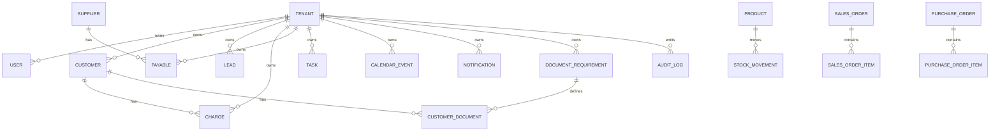

# WEBBA ERP - Arquitetura do Sistema

## Objetivo

WEBBA ERP e uma plataforma SaaS multi-tenant para centralizar vida financeira, clientes, cobrancas, documentos, tarefas, agenda e respostas inteligentes sobre a operacao. O sistema deve responder com rapidez perguntas como quem deve, o que vence hoje, quanto ha para receber, quanto ha para pagar, quais documentos faltam e qual foi o resultado financeiro do periodo.

## Principios Arquiteturais

- Clean Architecture: controllers expõem contratos HTTP, services orquestram casos de uso e Prisma isola persistencia.
- DDD modular: cada dominio tem modulo proprio, DTOs, politicas de permissao e regras de tenant.
- CQRS pragmatico: comandos de escrita passam por DTO e auditoria; consultas agregadas ficam em services de leitura como Finance e AI.
- Event Driven Architecture: acoes assincronas passam por QueueService/BullMQ, especialmente lembretes, notificacoes e integracoes.
- Modular Monolith: deploy simples no inicio, com fronteiras prontas para virar microservicos.
- Tenant isolation: toda tabela operacional possui `tenantId` e toda consulta filtra por tenant.
- Financial consistency: dinheiro em centavos, lancamentos contabeis por partida dobrada e baixa controlada.
- Audit logging: toda mudanca relevante gera AuditLog.

## Modulos

| Modulo | Responsabilidade |
| --- | --- |
| Auth e Tenants | Cadastro de empresa, login JWT, usuarios, perfis e isolamento |
| Financeiro | Contas a receber, contas a pagar, fluxo de caixa, DRE e categorias |
| Cobrancas | Devedores, status, PIX, historico e lembretes |
| CRM | Leads, funil, interacoes comerciais e conversao |
| Documentos | Checklist dinamico por cliente, status e referencias de arquivo |
| Tarefas | Lista, kanban e calendario operacional |
| Lembretes | Agendamentos automaticos via sistema, WhatsApp e e-mail |
| Calendario | Eventos, visitas, vencimentos, contratos e tarefas |
| Notificacoes | Central de alertas e fila de envio |
| IA | Consulta semantica/estruturada aos dados do tenant |
| Auditoria | Registro de alteracoes, seguranca e rastreabilidade |

## Diagrama de Entidades

## APIs Principais

| Area | Endpoints |
| --- | --- |
| Auth | `POST /auth/register`, `POST /auth/login`, `GET /users`, `POST /users` |
| Clientes | `GET /customers`, `POST /customers` |
| Cobrancas | `GET /charges`, `POST /charges`, `GET /charges/:id/pix`, `POST /charges/:id/pay` |
| Financeiro | `GET /finance/summary`, `GET /finance/cashflow`, `GET /payables`, `POST /payables`, `POST /payables/:id/pay` |
| CRM | `GET /leads`, `POST /leads`, `PATCH /leads/:id/stage` |
| Documentos | `GET /documents/requirements`, `POST /documents/requirements`, `GET /documents/customers/:customerId`, `POST /documents/customers/:customerId`, `PATCH /documents/customer-documents/:id/status` |
| Tarefas | `GET /tasks`, `POST /tasks`, `PATCH /tasks/:id/toggle` |
| Calendario | `GET /calendar/events`, `POST /calendar/events`, `PATCH /calendar/events/:id/status` |
| Notificacoes | `GET /notifications`, `POST /notifications`, `PATCH /notifications/:id/read` |
| IA | `POST /ai/ask`, `GET /ai/suggestions` |
| Auditoria | `GET /audit` |

## Perfis e Permissoes

| Perfil | Permissoes |
| --- | --- |
| ADMIN | Acesso total ao tenant, configuracoes, usuarios, baixa financeira e auditoria |
| FINANCE | Contas a receber, pagar, fluxo de caixa, DRE, cobrancas e notificacoes financeiras |
| COMMERCIAL | Clientes, leads, cobrancas comerciais, documentos e tarefas |
| OPERATIONS | Documentos, tarefas, calendario, visitas e acompanhamento de clientes |
| USER | Consulta operacional, tarefas proprias, calendario e assistente IA |
| SUPERADMIN | Administracao da plataforma SaaS e planos |

## Fluxos de Negocio

### Nova cobranca

1. Usuario autorizado cria cobranca para cliente do mesmo tenant.
2. Sistema valida DTO, cliente, valor positivo e data.
3. Cobranca nasce como `PENDING`.
4. Ledger registra `ACCOUNTS_RECEIVABLE` contra `REVENUE`.
5. Auditoria registra `CHARGE_CREATED`.
6. Job de lembrete e colocado na fila.
7. PIX pode ser gerado pela rota da cobranca.

### Baixa de recebimento

1. Usuario com permissao financeira confirma pagamento.
2. Sistema impede baixa duplicada.
3. Cobranca muda para `PAID`.
4. Ledger registra `CASH` contra `ACCOUNTS_RECEIVABLE`.
5. Auditoria registra `CHARGE_PAID`.

### Conta a pagar

1. Financeiro cria payable com fornecedor, categoria, valor e vencimento.
2. Ledger reconhece `EXPENSE` contra `ACCOUNTS_PAYABLE`.
3. Na baixa, ledger registra `ACCOUNTS_PAYABLE` contra `CASH`.
4. Notificacoes avisam vencimentos proximos.

### Documentos de cliente

1. Admin/comercial cria requisitos de documentos.
2. Operacional registra documentos do cliente e status.
3. Status evolui entre `NOT_SENT`, `SENT`, `IN_REVIEW`, `APPROVED`, `REJECTED`.
4. Pendencias alimentam dashboard, calendario e IA.

### Pergunta para IA

1. Usuario envia pergunta.
2. AIService classifica intencao e executa consultas filtradas por tenant.
3. Resposta natural e gerada com dados agregados.
4. Sem dados sensiveis de outros tenants e sem depender de IDs internos.

## Melhorias Recomendadas para Producao

- Trocar SQLite por PostgreSQL e ativar migrations versionadas.
- Guardar arquivos em S3/GCS com URLs assinadas e antivirus.
- Implementar refresh token rotativo com revogacao.
- Usar BullMQ com Redis real para notificacoes e webhooks.
- Adicionar ABAC por escopo, unidade, carteira de clientes e responsavel.
- Criar outbox pattern para eventos de dominio.
- Adicionar OpenTelemetry, metricas de filas e trilha de erros.
- Criar RLS no PostgreSQL para reforcar isolamento por tenant.
- Implantar testes e2e por modulo e testes de regressao financeira.

## Funcionalidades Extras de Alto Valor

- Importacao de clientes, despesas e documentos via CSV/XLSX.
- Portal do cliente para envio de documentos e consulta de cobrancas.
- Score de risco de inadimplencia.
- Modelos de mensagens de cobranca com aprovacao.
- Conciliacao bancaria e leitura OFX.
- Alertas de SLA para documentos parados.
- Previsao de caixa por contrato recorrente.
- Auditoria exportavel para contabilidade.
- RAG com Qdrant para busca semantica em documentos e historico.
